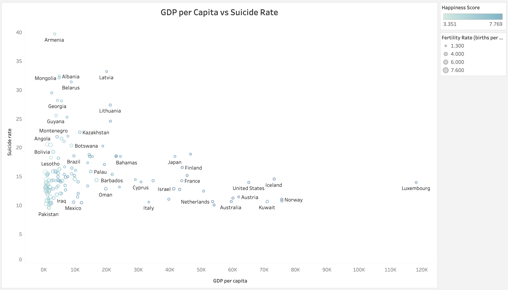
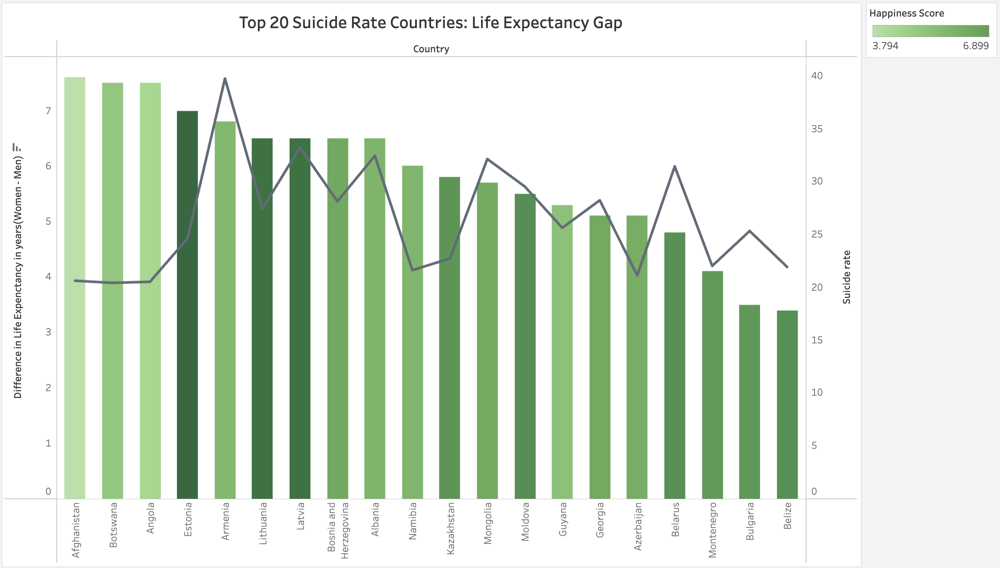

# Wealth-and-Well-being-A-Global-Suicide-Analysis
This project examines the link between GDP per capita, suicide rates, and the life expectancy gap between men and women, revealing how economic and health factors influence mental well-being globally.

# Wealth, Gender Gaps, and Mental Health: A Global Analysis of Suicide Rates

## Why This Project?

Suicide rates reflect the complex and interwoven relationship between a country’s economic status, societal well-being, and gender disparities. This project explores the interplay between **GDP per capita**, **suicide rates**, **life expectancy gaps between men and women**, and **happiness scores** to reveal key patterns in global mental health. Our analysis aims to uncover how societal wealth, gender inequality, and happiness contribute to or mitigate the risk of suicide in different countries.

---

## 1. GDP per Capita vs Suicide Rate: How Does Wealth Impact Suicide Rates?

### The Story Behind the Data:
- **Wealth as a Protective Factor (but Not Always)**: As seen in countries like Luxembourg and Norway, high GDP per capita correlates with lower suicide rates, suggesting that wealth and access to better social and healthcare services may offer some protection against mental health crises. However, **wealth alone doesn’t always prevent high suicide rates**. Armenia, for example, experiences a much higher suicide rate despite a lower GDP, indicating that other cultural or social factors are at play.
- **Economic Threshold Effect**: We see a cluster of countries with lower GDPs (below $20K per capita) that still exhibit a wide range of suicide rates, from 10 to over 40 per 100,000 people. This suggests that while economic development can reduce some of the pressure, there are societal factors, like access to mental health resources or cultural views on mental health, that play a crucial role.
- **Happiness Score as a Proxy for Well-being**: The color gradient (happiness score) in the scatterplot further supports the connection between overall societal well-being and suicide rates. Countries with lower happiness scores tend to have higher suicide rates, indicating that mental well-being is about more than just money—it's tied to social, emotional, and psychological factors.

---

## 2. Top 20 Suicide Rate Countries: The Gender Gap in Life Expectancy

### The Story Behind the Data:
- **Life Expectancy Gap and Gender-Specific Pressures**: In the top 20 countries with the highest suicide rates, we see a consistent gap between life expectancy for women and men. Countries like Lithuania and Estonia show the widest gaps, with men living significantly shorter lives. These countries also have some of the highest suicide rates, suggesting that **men in these regions face unique societal pressures and health challenges**—whether through riskier lifestyles, lack of mental health support, or cultural expectations placed on men.
- **High Suicide Rates, Moderate Gaps**: Countries like Belarus and Kazakhstan also have high suicide rates but smaller gaps in life expectancy. This suggests that both genders may be facing societal or economic pressures, indicating a more widespread mental health issue that affects the entire population.
- **Happiness Score Reflects Broader Well-being**: The color-coded happiness score adds another layer to the story. Countries with lower happiness scores (represented by darker shades of green) often show both higher suicide rates and larger gender gaps in life expectancy. This suggests that societal well-being plays a major role in both mental health and physical longevity, particularly when gender disparities are involved.

---

## Conclusion: Addressing Mental Health Through Targeted Interventions

The analysis of **GDP per capita**, **life expectancy gaps**, and **suicide rates** across countries shows that economic prosperity does not guarantee low suicide rates, and gender disparities play a critical role in mental health outcomes. Countries like **Lithuania** and **Estonia** exhibit large **life expectancy gaps** between men and women, with men facing significantly higher suicide rates. These countries need to address **male-targeted mental health interventions**, focusing on reducing societal pressures on men and increasing access to mental health services.

In contrast, countries like **Armenia** and **Mongolia** have high suicide rates despite low GDP per capita, showing that mental health crises are not solely a result of economic hardship. These nations should focus on expanding mental health infrastructure and de-stigmatizing mental illness in their populations. Furthermore, **Luxembourg**, with its extremely high GDP per capita and relatively low suicide rate, exemplifies how wealth, combined with strong social support systems, can mitigate the risk of suicide.

Finally, the **happiness score** indicates a strong correlation between societal well-being and mental health. Countries like **Belarus** and **Kazakhstan**, which have lower happiness scores and higher suicide rates, should focus on improving social conditions, addressing mental health at the community level, and providing broader support for emotional well-being.

### Key Recommendations:
1. **For Estonia and Lithuania**: Invest in **men's mental health programs** and reduce harmful societal pressures that disproportionately affect men.
2. **For Armenia and Mongolia**: Expand mental health infrastructure, including training healthcare providers, and work on **mental health awareness campaigns** to reduce stigma.
3. **For Belarus and Kazakhstan**: Address societal well-being more broadly by improving overall **quality of life**, including social services, education on mental health, and community support systems.

---

### Data Sources:
- This analysis is based on global data related to **GDP per capita**, **suicide rates**, **life expectancy** for men and women, and **happiness scores**, drawn from publicly available databases---OECD, IHME, and World Bank database. 
